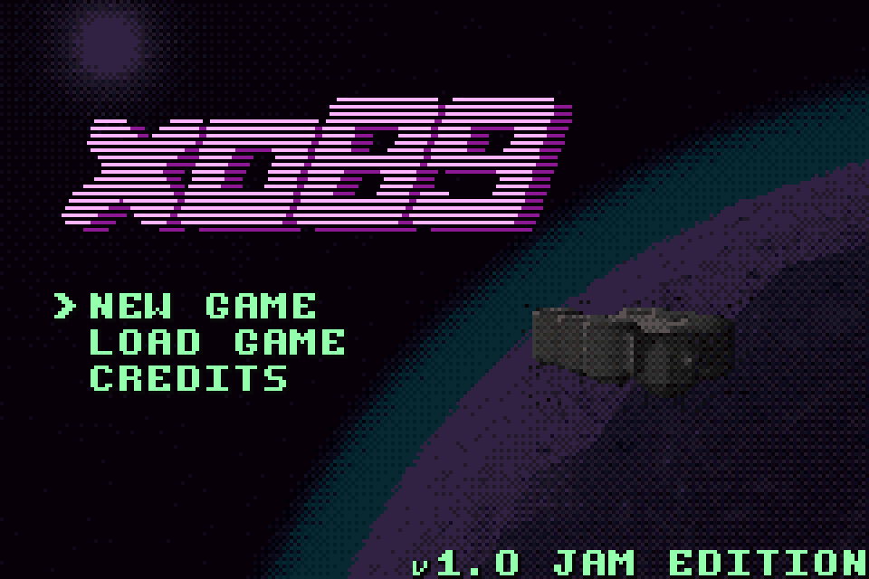
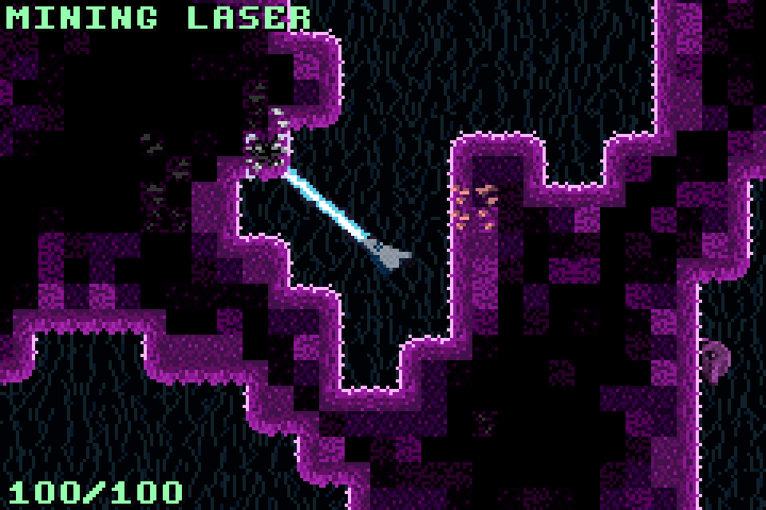
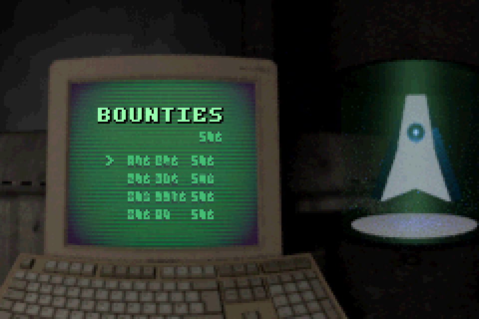

You can play it in your browser at https://nostabyte.itch.io/xo89

	
	
	

My submission for [GBA Jam 2026](https://itch.io/jam/gbajam26)

You are a lone pilot on the ship named xo89 orbiting an alien planet. Your job is to pilot a mining drone that harvests the resources from this planet and sell them. You can use the money to buy upgrade your drone.

### Features

- Procedurally generated destructible terrain.
- A physics engine for simulating the ship, items, and projectiles.
- Pre-rendered 3D Backgrounds.
- Rocket Launcher!

### Additional Credits

- Made with [Butano Engine](https://github.com/GValiente/butano)
- 3D assets by [PIZZA DOGGY](https://pizzadoggy.itch.io/)
- Sounds from [https://freesound.org/](https://freesound.org/)
- Perlin noise code by [Sean Barrett](https://github.com/nothings/stb/blob/master/stb_perlin.h)